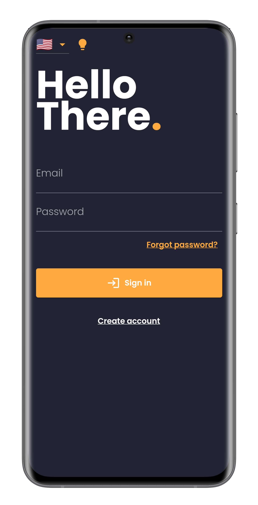
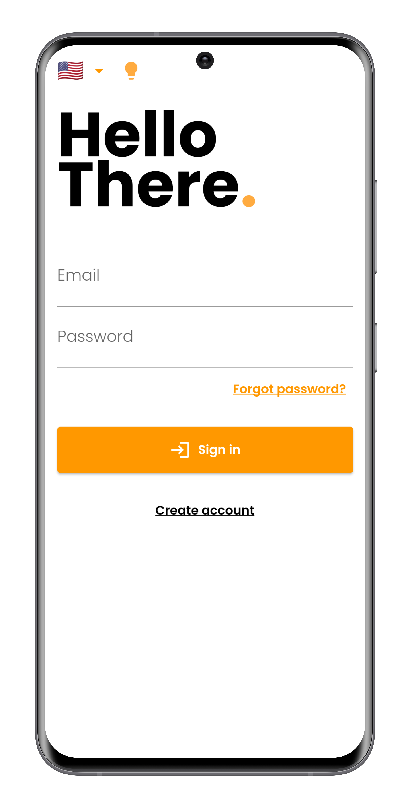
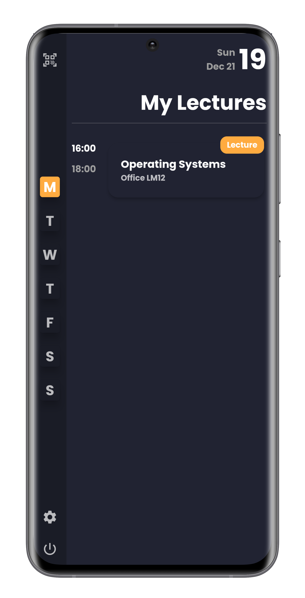
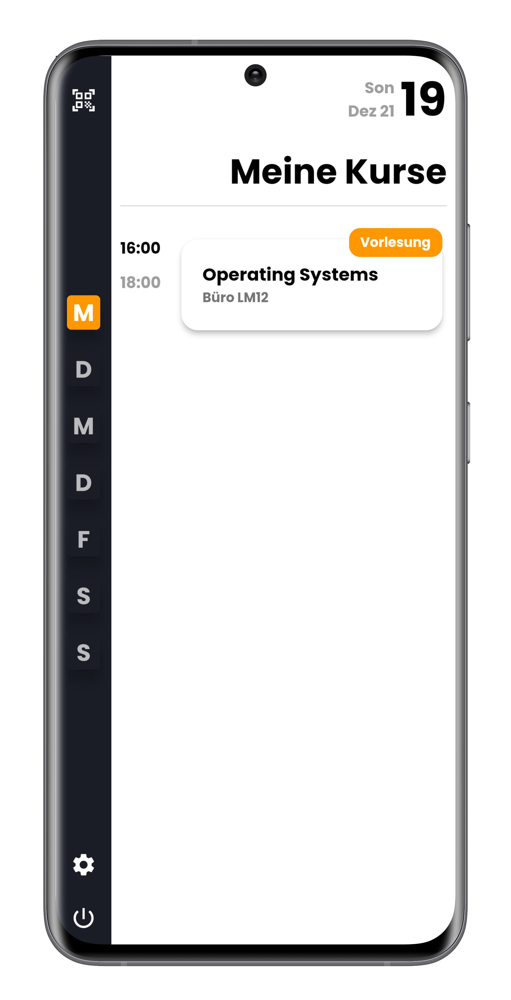
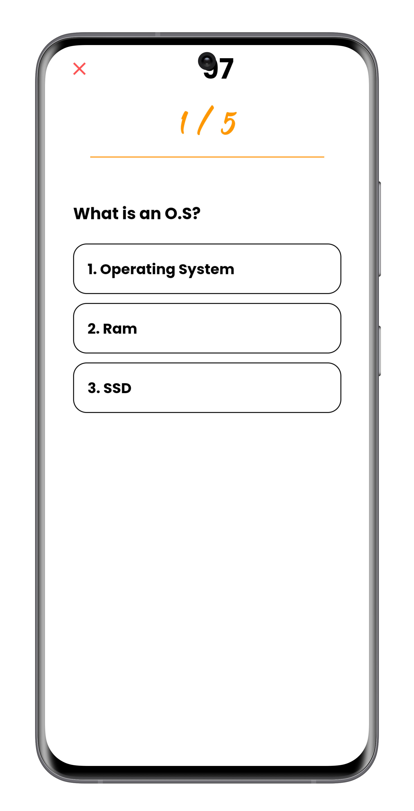
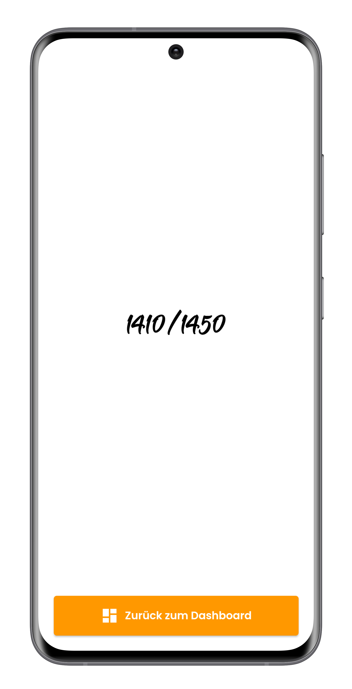

# Crayon Student Application

The students will use this application to consume the content provided by the Crayon Management application.

## Table of contents
* [Screenshots](#screenshots)
* [General info](#general-info)
* [Requirements](#requirements)
* [Technologies](#technologies)
* [Setup](#setup)

## Screenshots

Splash screen            |  Login Light | Login Dark
:-------------------------:|:-------------------------:|:-------------------------:
  |  |  

Dashboard Light            |  Dashboard Dark 
:-------------------------:|:-------------------------:
 |  

Quiz            |  Score
:-------------------------:|:-------------------------:
 |  

## General info
The student application is fully functional and uses as a backend firestore to create and consume data. The key functionalities of this applications are the following:
* Joining lectures
* Participate in quizzes
* Asking questions

The student who uses this application must join a lecture over a QR code provided by the management system to join a course and gain access to the other critical functionalities of the application. 
Participating in a quiz can only be done if the Management application launches a quiz. To join the quiz, the user must only provide a username. In addition, asking questions can be done at any time. Even if the
lecture is not live. The key feature here is that the student's personal information will not be revealed to the teacher to prevent anxious students from not asking questions. 

## Requirements
The application works for both iOS and Android devices. Android versions below the KitKat versions are not supported and will not work.

## Technologies

The code is written in plain Dart and uses the Framework Flutter.

## Setup
Download the project and open it in your favourite IDE. To launch/deploy the application, a local virtual device or an actual device must be connected to the PC. After the flutter run command should be executed in the projects folder to run the application.

## Additional Screenshots
To see additional screenshots of the Crayon Management application and Crayon Student application, the following webpage provides this:
[Crayon](https://schroederlionel.github.io/crayon/)
